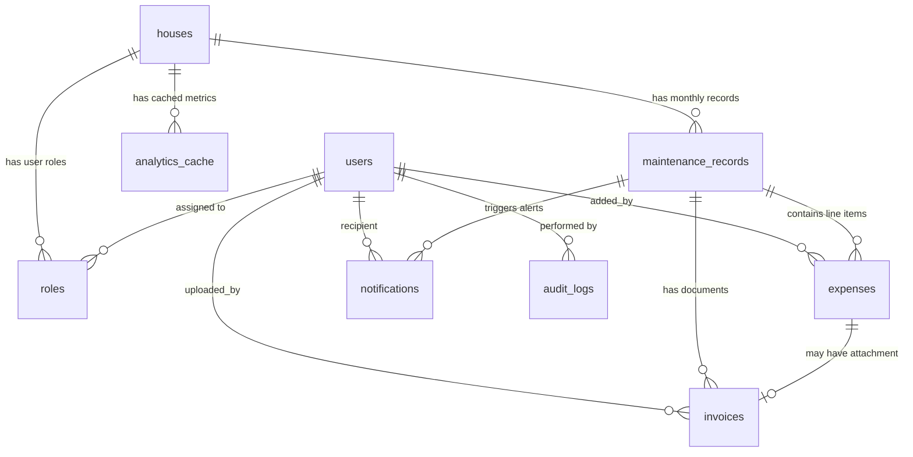

# 🏢 MADURA HOUSE MAINTENANCE MANAGEMENT — Complete Project Context

> **Purpose**: This document is the single-source-of-truth context file for AI agents working on this codebase. Read this ENTIRELY before making any changes.

---

## 1. PROJECT IDENTITY

| Field | Value |
|-------|-------|
| **Name** | CHE-MADURA HS-1 MGMT (Madura House Maintenance Management) |
| **Version** | V0.1 |
| **Property** | 91/16, Kovilpatti Gopalakrishnan Street, Karthikeyan Nagar, Maduravoyal, Chennai - 600095 |
| **Units** | 5 flats: `GF`, `F01 - FRONT`, `F01 - BACK`, `F02 - FRONT`, `F02 - BACK` |
| **Repo** | `github.com/insvk/HOUSE-MGMT-V0.1` (branch: `main`) |
| **Local Dev** | `http://localhost:5173` |
| **Currency** | INR (₹) |

---

## 2. TECHNOLOGY STACK

| Layer | Technology | Version |
|-------|-----------|---------|
| **Frontend** | React + TypeScript | React 18.3, TS 5.7 |
| **Styling** | TailwindCSS | 3.4 |
| **Build** | Vite | 6.0 |
| **Icons** | lucide-react | 0.474 |
| **Charts** | Recharts | 2.15 |
| **PDF Export** | jsPDF + jspdf-autotable | 4.2 / 5.0 |
| **Excel Export** | xlsx (SheetJS) | 0.18 |
| **Desktop** | Electron (optional, skipped in CI) | 44.3 |
| **Backend DB** | Supabase Cloud PostgreSQL | PG 17.6, GoTrue v2.197 |
| **Auth** | Supabase GoTrue + custom plaintext fallback | `@supabase/supabase-js ^2.116` |
| **Email** | Resend API (via Vite middleware proxy) | — |
| **Clock Sync** | Google NTP (`time.google.com`) via Vite middleware | — |
| **Deployment** | Vercel (web) / Electron (desktop) / Netlify (alt) / Docker | — |

---

## 3. FILE STRUCTURE & PURPOSE

```
s:\vs code\HOUSE MAINTENEANCE MGMT\
├── .env                          # Live environment variables (Supabase URL, anon key, Resend key)
├── .env.example                  # Template for .env
├── CREDENTIALS.md                # Official credentials & access spec document
├── package.json                  # Dependencies & scripts (dev, build, build:desktop, db:sync)
├── vite.config.ts                # Vite config + Google Time middleware + Resend email middleware
├── tsconfig.json                 # TypeScript config
├── tailwind.config.js            # Tailwind theme config
├── index.html                    # HTML entry point
├── vercel.json                   # Vercel SPA rewrite config
├── netlify.toml                  # Netlify build config
├── Dockerfile                    # Docker build
├── nginx.conf                    # Nginx reverse proxy config
│
├── src/
│   ├── main.tsx                  # React entry point (renders <App />)
│   ├── App.tsx                   # ★ MONOLITH: 2292 lines. ALL state, handlers, layout, routing
│   ├── index.css                 # Global CSS imports (Tailwind directives)
│   │
│   ├── types/
│   │   └── index.ts              # TypeScript interfaces: User, House, Expense, MaintenanceRecord,
│   │                             #   Invoice, NotificationLog, AuditLog, UserRole, ExpenseCategory
│   │
│   ├── data/
│   │   └── initialData.ts        # Seed data, DEFAULT_CREDENTIALS, isDummyLegacyAccount/Expense helpers
│   │
│   ├── lib/
│   │   ├── supabaseClient.ts     # ★ CORE: Supabase client init, cloudDb adapter (CRUD for all tables),
│   │   │                         #   realtime subscriptions, storage upload, mapDbRowToUser()
│   │   ├── authService.ts        # ★ AUTH: Universal login (email/username/UUID/flat), signup, logout,
│   │   │                         #   password reset, 2FA TOTP, security event logging
│   │   ├── resendClient.ts       # Email dispatch: bulk/single via Resend API, HTML templates
│   │   └── googleTimeClient.ts   # NTP clock sync with time.google.com, timezone formatting
│   │
│   ├── components/
│   │   ├── LoginPage.tsx         # Login/signup portal with tabs, avatar selection, flat picker
│   │   ├── Dashboard.tsx         # ★ Main dashboard: KPI cards, charts, expense summary, quick actions
│   │   ├── MaintenanceModule.tsx # Monthly expense ledger: add/edit/delete expenses, invoice attach
│   │   ├── TenantDirectory.tsx   # Tenant roster: add/edit/remove tenants, role management
│   │   ├── AnalyticsDashboard.tsx# Charts & metrics visualization
│   │   ├── InvoiceGallery.tsx    # Invoice document gallery with preview
│   │   ├── InvoicePreviewModal.tsx# Full invoice viewer with OCR text display
│   │   ├── NotificationCenter.tsx# Email notification dispatch & delivery log
│   │   ├── AuditLogViewer.tsx    # Security audit trail viewer
│   │   ├── GodModeMasterModal.tsx# ★ Owner-only: bulk data sync, advanced admin, "God Maxx" controls
│   │   ├── SettingsModal.tsx     # App settings, Resend config, export/restore, cloud sync
│   │   ├── EditExpenseModal.tsx  # Inline expense editor modal
│   │   ├── EditProfileModal.tsx  # User profile editor
│   │   ├── AvatarUploadModal.tsx # Profile picture upload (camera/file/presets/initials)
│   │   ├── CommandPalette.tsx    # Ctrl+K global search & navigation
│   │   ├── SecurityDashboardModal.tsx # Security events viewer, 2FA controls
│   │   ├── GoogleClock.tsx       # NTP-synced IST clock widget (header/fullscreen)
│   │   ├── ErrorBoundary.tsx     # React error boundary with cache reset
│   │   └── InvoiceAttachmentPill.tsx # Inline invoice attachment indicator
│   │
│   └── utils/
│       ├── exportUtils.ts        # PDF & Excel report generation (jsPDF, SheetJS)
│       ├── audioUtils.ts         # Sound chimes (success, warning, notification)
│       └── imageUtils.ts         # Image compression, base64 conversion, avatar processing
│
├── database/
│   ├── schema.sql                # Original DDL (9 tables, basic RLS)
│   ├── fix_auth_schema.sql       # ★ MASTER migration: adds 13+ columns, triggers, RLS, auth setup
│   ├── make_permanent.sql        # Re-creates tables, permissive RLS, seeds owner/house/record
│   ├── add_cloud_preferences_migration.sql  # Adds preferences, role, rent columns to users
│   ├── cleanup_duplicates.sql    # Purges typo accounts, enables realtime
│   ├── seed-data.sql             # Idempotent seed: owner, house, maintenance record
│   └── migrations/
│       ├── 001_secure_rls_policies.sql  # ★ NEW: Proper role-based RLS (NOT YET APPLIED)
│       └── 002_schema_cleanup.sql       # ★ NEW: Drop duplicate indexes, storage policies
│
├── api/
│   ├── google-time.ts            # Serverless function: Google NTP time fetch
│   └── send-email.ts             # Serverless function: Resend email dispatch
│
├── scripts/
│   └── sync-db.cjs               # Node.js DB sync script (npm run db:sync)
│
├── electron/                     # Electron main process files
├── supabase/                     # Supabase CLI config (linked to kbvjnshgyuwkcvicwefh)
│   └── .temp/                    # CLI metadata (project-ref, pg version, etc.)
│
└── [Root SQL files]              # Ad-hoc migration scripts (legacy, some stale)
    ├── supabase_auth_migration.sql   # ⚠️ STALE: uses "camelCase" columns, never adopted
    ├── add_username_migration.sql    # Adds username column
    ├── remove_email_confirmation.sql # Auto-confirm trigger
    └── fix_email_confirmations.sql   # Backfill email_confirmed_at
```

---

## 4. DATABASE SCHEMA (Supabase Cloud PostgreSQL)

### Supabase Project

| Field | Value |
|-------|-------|
| **Project Ref** | `kbvjnshgyuwkcvicwefh` |
| **Org** | `zkzsxynnpaimsnmeohhd` |
| **Region** | South Asia (Mumbai) `ap-south-1` |
| **URL** | `https://kbvjnshgyuwkcvicwefh.supabase.co` |
| **PG Version** | 17.6.1.166 |
| **GoTrue** | v2.197.0 |

### 4.1 Tables (11 in `public` schema)

#### `users` — Primary tenant/resident directory
```sql
id              UUID PRIMARY KEY DEFAULT gen_random_uuid()
auth_id         UUID REFERENCES auth.users(id) ON DELETE SET NULL  -- links to GoTrue
email           VARCHAR(255) UNIQUE NOT NULL
username        TEXT UNIQUE  -- @username login
password        TEXT  -- ⚠️ PLAINTEXT (security risk, to be removed)
phone           VARCHAR(20)
full_name       VARCHAR(255) NOT NULL
flat_number     VARCHAR(50)
avatar_url      TEXT
role            VARCHAR(20) DEFAULT 'TENANT'  -- 'OWNER' | 'ADMIN_TENANT' | 'TENANT'
occupancy_status VARCHAR(20) DEFAULT 'active'  -- 'active' | 'inactive' | 'evicted'
payment_status  VARCHAR(20) DEFAULT 'paid'     -- 'paid' | 'pending' | 'unpaid'
maintenance_status VARCHAR(20) DEFAULT 'unpaid'
rent_amount     DECIMAL(12, 2)
deposit_amount  DECIMAL(12, 2)
move_in_date    DATE
emergency_contact VARCHAR(255)
notes           TEXT
preferences     JSONB DEFAULT '{}'  -- {audioEnabled, clock24h}
is_active       BOOLEAN DEFAULT true
created_at      TIMESTAMPTZ NOT NULL DEFAULT now()
updated_at      TIMESTAMPTZ NOT NULL DEFAULT now()
deleted_at      TIMESTAMPTZ  -- soft-delete
```

**Key users (hardcoded/seed):**
- `a0eebc99-9c0b-4ef8-bb6d-6bb9bd380a11` → `sampathkumar@chemadura.com` (OWNER)
- `b1ffcd99-8d0c-4ef8-bb6d-6bb9bd380a22` → `rsivanaresh@gmail.com` (OWNER/ADMIN)

#### `houses` — Property master (single row for this app)
```sql
id              UUID PRIMARY KEY DEFAULT gen_random_uuid()
owner_id        UUID REFERENCES users(id)
name            VARCHAR(255) DEFAULT 'Madura House Maintenance'
address         TEXT
city            VARCHAR(100) DEFAULT 'Chennai'
postal_code     VARCHAR(20) DEFAULT '600095'
total_units     INTEGER DEFAULT 5
settings        JSONB DEFAULT '{}'  -- {currency, upiId, upiName, lateFee*, defaultRentDueDay, maintenanceDueDay}
created_at      TIMESTAMPTZ NOT NULL DEFAULT now()
updated_at      TIMESTAMPTZ NOT NULL DEFAULT now()
```

**Canonical house ID:** `11111111-2222-3333-4444-555555555555`

#### `roles` — RBAC junction (user ↔ house)
```sql
id              UUID PRIMARY KEY
user_id         UUID NOT NULL REFERENCES users(id) ON DELETE CASCADE
house_id        UUID NOT NULL REFERENCES houses(id) ON DELETE CASCADE
role_type       VARCHAR(20) NOT NULL  -- 'OWNER' | 'ADMIN_TENANT' | 'TENANT'
permissions     JSONB DEFAULT '{}'
CONSTRAINT unique_user_house_role UNIQUE(user_id, house_id)
```
> ⚠️ **NOTE**: The `roles` table is NOT used by application code. The app reads role from `users.role` directly.

#### `maintenance_records` — Monthly billing header
```sql
id                      UUID PRIMARY KEY
house_id                UUID NOT NULL REFERENCES houses(id) ON DELETE CASCADE
month                   INTEGER NOT NULL CHECK (1..12)
year                    INTEGER NOT NULL CHECK (>= 2020)
created_by              UUID REFERENCES users(id)
grand_total             DECIMAL(12, 2) DEFAULT 0.00
number_of_active_tenants INTEGER DEFAULT 5
individual_contribution DECIMAL(12, 2) GENERATED ALWAYS AS (
                          CASE WHEN number_of_active_tenants > 0
                               THEN grand_total / number_of_active_tenants
                               ELSE 0.00 END
                        ) STORED  -- ⚠️ Do NOT include in INSERT/UPDATE payloads!
notes                   TEXT
CONSTRAINT unique_house_month_year UNIQUE(house_id, month, year)
```

**Canonical record ID:** `22222222-3333-4444-5555-666666666666` (September 2026)

#### `expenses` — Line-item expense details
```sql
id                      UUID PRIMARY KEY
maintenance_record_id   UUID NOT NULL REFERENCES maintenance_records(id) ON DELETE CASCADE
sl_no                   INTEGER
particular              VARCHAR(255) NOT NULL
amount                  DECIMAL(12, 2) NOT NULL CHECK (>= 0)
category                VARCHAR(50) DEFAULT 'maintenance'  -- maintenance|utilities|repairs|cleaning|other
gst_applicable          BOOLEAN DEFAULT false
gst_amount              DECIMAL(12, 2) DEFAULT 0.00
notes                   TEXT
added_by                UUID REFERENCES users(id)
invoice_url             TEXT
invoice_file_name       VARCHAR(255)
invoice_file_type       VARCHAR(50)
invoice_file_size       INTEGER
ocr_text                TEXT
created_at / updated_at TIMESTAMPTZ
```

#### `invoices` — Document archive
```sql
id, expense_id (FK), maintenance_record_id (FK), file_name, file_size, file_type,
storage_path TEXT NOT NULL, ocr_data JSONB, uploaded_by UUID (FK), created_at
```

#### `notifications` — Email dispatch log
```sql
id, maintenance_record_id (FK), recipient_id UUID NOT NULL (FK users),
type VARCHAR(50) CHECK (maintenance_added|contribution_due|payment_received),
subject, content TEXT NOT NULL, metadata JSONB, sent_at, read_at, created_at
```

#### `audit_logs` — Security audit trail
```sql
id, user_id (FK), user_email TEXT, action VARCHAR(255) NOT NULL,
resource_type, resource_id TEXT, changes JSONB, ip_address INET, user_agent TEXT, created_at
```

#### `security_events` — Auth event log
```sql
id, auth_id UUID (FK auth.users), user_email TEXT NOT NULL,
event_type TEXT NOT NULL, ip_address TEXT, user_agent TEXT, created_at
```

#### `system_secrets` — API keys / secrets storage
```sql
id, key_name VARCHAR(100) UNIQUE NOT NULL, key_value TEXT NOT NULL, created_at, updated_at
```

#### `analytics_cache` — Metrics cache (UNUSED by app)
```sql
id, house_id (FK), metric_type VARCHAR(100), period VARCHAR(50),
data JSONB NOT NULL, calculated_at, expires_at,
CONSTRAINT unique_house_metric_period UNIQUE(house_id, metric_type, period)
```

### 4.2 Entity Relationship Diagram



### 4.3 Database Triggers

| Trigger | On Table | Function | Purpose |
|---------|----------|----------|---------|
| `auto_confirm_users_trigger` | `auth.users` BEFORE INSERT | `auto_confirm_users()` | Auto-sets `email_confirmed_at = now()` to bypass email confirmation |
| `on_auth_user_created` | `auth.users` AFTER INSERT | `handle_new_auth_user()` | Auto-creates `public.users` row when GoTrue user signs up |

### 4.4 RLS Policies (CURRENT STATE — ALL WIDE OPEN)

> ⚠️ **CRITICAL**: All tables currently have `FOR ALL USING(true) WITH CHECK(true)` — equivalent to no security. Migration `001_secure_rls_policies.sql` has been created but NOT YET APPLIED.

### 4.5 Realtime (supabase_realtime publication)

Tables in publication: `users`, `houses`, `maintenance_records`, `expenses`, `invoices`, `notifications`, `audit_logs`

NOT in publication: `security_events`, `system_secrets`, `analytics_cache`, `roles`

---

## 5. AUTHENTICATION FLOW

The app uses a **dual-auth** system (to be refactored to GoTrue-only):

### Login Flow
1. User enters identifier (email / @username / UUID / flat number) + password
2. **Step 1**: Resolve user identity from `public.users` via Supabase query
3. **Step 2**: Compare password against `public.users.password` (plaintext) or `DEFAULT_CREDENTIALS`
4. **Step 3 (if match)**: JIT-create GoTrue auth user if missing, get JWT session
5. **Step 3 (if no match)**: Try native GoTrue `signInWithPassword()` as fallback
6. **Step 4**: Return `{success, user, session, profile}` to App.tsx
7. If GoTrue fails entirely: synthetic session token `tenant_token_{id}_{timestamp}` is created

### Key Auth Constants
```typescript
// Hardcoded owner emails (override DB role to OWNER)
OWNER_EMAILS = ['sampathkumar@chemadura.com', 'rsivanaresh@gmail.com']

// Default credentials in client bundle (security risk)
DEFAULT_CREDENTIALS = {
  'sampathkumar@chemadura.com': 'Sampath@123',
  'production.chemadura26@gmail.com': 'Sampath@123',
  'rsivanaresh@gmail.com': 'Sivakalai#83',
}
```

### Supported Auth Features
- Email/password login (universal identifier: email, username, UUID, flat)
- Self-registration via Create Account tab
- Password reset via OTP (Supabase GoTrue)
- 2FA TOTP enrollment and verification
- Security event logging (LOGIN, LOGOUT, PASSWORD_CHANGE, etc.)

---

## 6. DATA PERSISTENCE MODEL

### Dual-Tier Architecture
| Tier | Mechanism | Purpose |
|------|-----------|---------|
| **Primary** | Supabase Cloud PostgreSQL | Authoritative source of truth |
| **Secondary** | Browser `localStorage` | Offline fallback, instant UI, cache |

### localStorage Keys
| Key | Content |
|-----|---------|
| `madura_house_users_v2` | User array (passwords scrubbed) |
| `madura_house_records_v1` | Maintenance records with nested expenses |
| `madura_house_property_v1` | House/property settings |
| `madura_house_invoices_v1` | Invoice metadata |
| `madura_house_notifications_v1` | Notification logs |
| `madura_theme` | `'light'` or `'dark'` |

### Sync Flow
1. On app load: read localStorage first (instant UI), then fetch from Supabase
2. Cloud data is "smart merged" with local data (non-destructive)
3. All writes go to Supabase first (optimistic UI), rollback on failure
4. Realtime subscriptions push live changes from other devices
5. On network restore: auto-resync from Supabase

---

## 7. STATE MANAGEMENT

**App.tsx is a monolith** (~2300 lines). All state lives in the root component:

### Core State
```typescript
const [users, setUsers] = useState<User[]>(...)
const [records, setRecords] = useState<MaintenanceRecord[]>(...)
const [house, setHouse] = useState<House>(...)
const [invoices, setInvoices] = useState<Invoice[]>(...)
const [notificationLogs, setNotificationLogs] = useState<NotificationLog[]>(...)
const [auditLogs, setAuditLogs] = useState<AuditLog[]>(...)
```

### Auth State
```typescript
const [isLoggedIn, setIsLoggedIn] = useState<boolean>(false)
const [currentUser, setCurrentUser] = useState<User>(...)
const [currentUserRole, setCurrentUserRole] = useState<UserRole>('OWNER')
```

### Navigation Tabs
`dashboard` | `maintenance` | `tenants` | `analytics` | `invoices` | `notifications` | `audit`

---

## 8. REALTIME SUBSCRIPTIONS

The `subscribeToAllPlatformChanges()` method in `supabaseClient.ts` subscribes to 6 tables on a single channel (`realtime:madura_house_platform_sync`):

| Table | Handler |
|-------|---------|
| `users` | Merge into state, update localStorage |
| `houses` | Update house state |
| `maintenance_records` | Refetch full record with expenses |
| `expenses` | Trigger full data refresh |
| `invoices` | Update invoices state |
| `notifications` | Update notification logs |

---

## 9. STORAGE BUCKETS

| Bucket | Purpose | Method |
|--------|---------|--------|
| `avatars` | Profile pictures | `cloudDb.uploadAvatar()` → `getPublicUrl()` |
| `invoices` | Invoice documents | `cloudDb.uploadInvoice()` → `getPublicUrl()` |

> ⚠️ These buckets may need to be created in Supabase Dashboard > Storage.

---

## 10. EMAIL SYSTEM (Resend)

- **Provider**: Resend (`api.resend.com`)
- **From**: `CHE-MADURA HS-1 MGMT <onboarding@resend.dev>`
- **Relay**: If 403 on target email, auto-relays to owner: `production.chemadura26@gmail.com`
- **Proxy**: Vite dev server at `/api/send-email` proxies to Resend (avoids CORS)

---

## 11. ENVIRONMENT VARIABLES

```env
VITE_SUPABASE_URL=https://kbvjnshgyuwkcvicwefh.supabase.co
VITE_SUPABASE_ANON_KEY=eyJhbGciOi...   # Public anon key (safe for client)
VITE_APP_NAME="MADURA HOUSE MAINTENANCE MGMT V0.1"
VITE_RESEND_API_KEY=re_Lw2RgDC1_...    # ⚠️ Should be server-side only
VITE_RESEND_FROM_EMAIL=onboarding@resend.dev
```

---

## 12. KEY CONVENTIONS & PATTERNS

### Column Naming
- **Database**: `snake_case` (e.g., `full_name`, `flat_number`, `occupancy_status`)
- **TypeScript**: `camelCase` (e.g., `fullName`, `flatNumber`, `occupancyStatus`)
- **Mapping**: `mapDbRowToUser()` in `supabaseClient.ts` converts between them

### UUID Usage
- All primary keys are UUID v4 (`gen_random_uuid()`)
- `generateUUID()` uses `crypto.randomUUID()` with manual fallback
- `isValidUUID()` validates before DB writes

### Error Handling Pattern
- All `cloudDb` methods return `{ success: boolean; error?: string }`
- Optimistic UI updates → cloud write → rollback on failure
- Silent fallbacks for non-critical operations (audio, clock, avatar)

### Legacy Cleanup
- `isDummyLegacyAccount(email)` filters out test/mock accounts
- `isDummyLegacyExpense(expense)` filters out dummy seed expenses
- Both applied on load and sync to prevent resurrection of purged data

---

## 13. KNOWN ISSUES & SECURITY FINDINGS

### 🔴 CRITICAL
1. **Plaintext passwords** in `public.users.password` — readable via anon key
2. **All RLS policies are `USING(true)`** — database is wide open
3. **Default credentials hardcoded** in client-side bundle
4. **Resend API key exposed** in client bundle

### 🟡 HIGH
5. `system_secrets` RLS has anon bypass (`OR auth.uid() IS NULL`)
6. Synthetic session tokens not validated by Supabase
7. Dual auth system causes password drift

### 🟡 MEDIUM
8. No conflict resolution for concurrent edits (last-write-wins)
9. 4 duplicate indexes on `users.username`
10. `roles` table unused — app uses `users.role` column
11. `analytics_cache` table completely unused

### Pending Migrations (created, NOT applied)
- `database/migrations/001_secure_rls_policies.sql` — Proper role-based RLS
- `database/migrations/002_schema_cleanup.sql` — Index cleanup, storage policies

---

## 14. CRITICAL RULES FOR AI AGENTS

> **NEVER** do any of the following:

1. **NEVER create a second Supabase project** — use `kbvjnshgyuwkcvicwefh`
2. **NEVER overwrite production data** — always use upsert patterns
3. **NEVER expose `service_role` key in frontend** — only `anon` key client-side
4. **NEVER make destructive DB changes** without explicit user consent
5. **NEVER send `individual_contribution`** in INSERT/UPDATE to `maintenance_records` — it's GENERATED STORED
6. **NEVER null out passwords during updates** — plaintext password is still auth source of truth
7. **NEVER use `"camelCase"` columns in SQL** — DB uses `snake_case`
8. **NEVER write passwords to localStorage** — scrubbed via `mapDbRowToUser()`

### Canonical IDs (Hardcoded Constants)
```
Owner User ID:     a0eebc99-9c0b-4ef8-bb6d-6bb9bd380a11
Admin User ID:     b1ffcd99-8d0c-4ef8-bb6d-6bb9bd380a22
House ID:          11111111-2222-3333-4444-555555555555
Sept 2026 Record:  22222222-3333-4444-5555-666666666666
```

### Owner Emails (Hardcoded in Multiple Places)
```
sampathkumar@chemadura.com      → OWNER (primary)
rsivanaresh@gmail.com           → OWNER/ADMIN_TENANT
production.chemadura26@gmail.com → OWNER (email relay target)
```

---

## 15. HOW TO RUN

```bash
npm install        # Install deps
npm run dev        # → http://localhost:5173
npm run build      # Production web build
npm run db:sync    # Sync database seed
```

### Supabase CLI (linked)
```bash
supabase link --project-ref kbvjnshgyuwkcvicwefh
supabase inspect db table-stats --linked
```

> Docker is NOT installed on this machine. `supabase db dump` and `supabase start` will fail.
